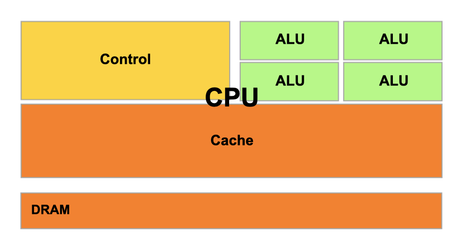
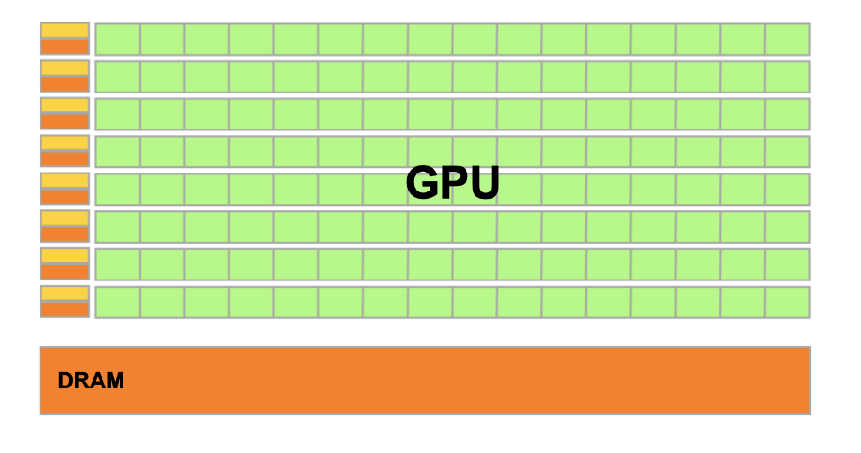
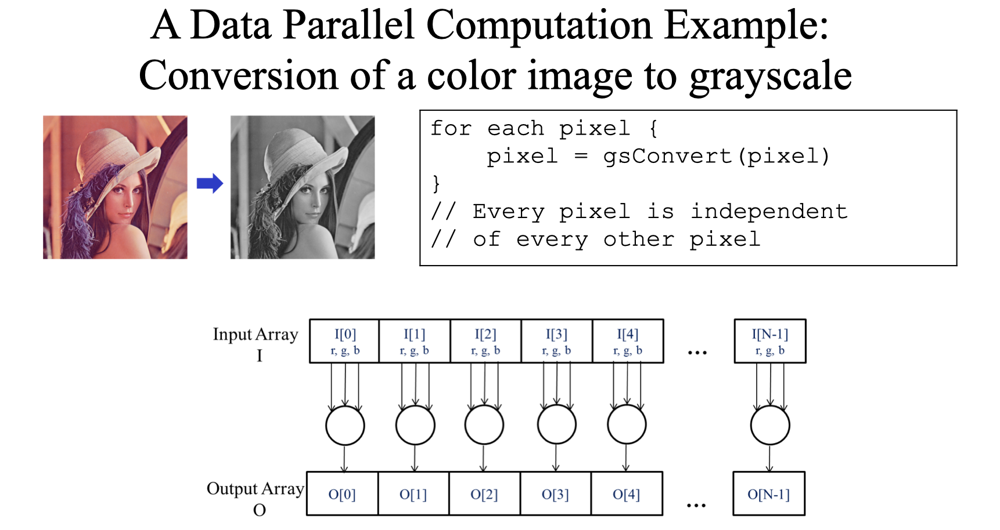
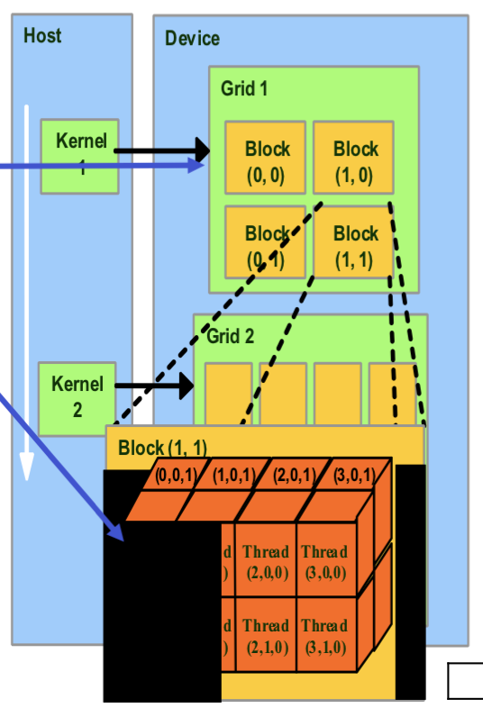
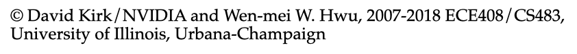
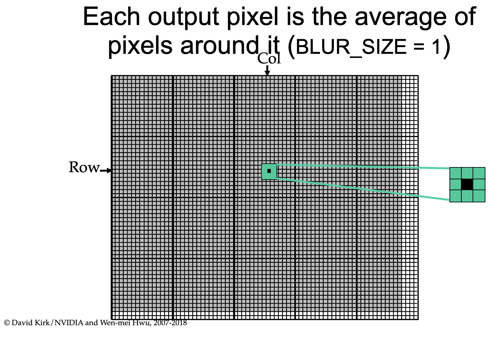
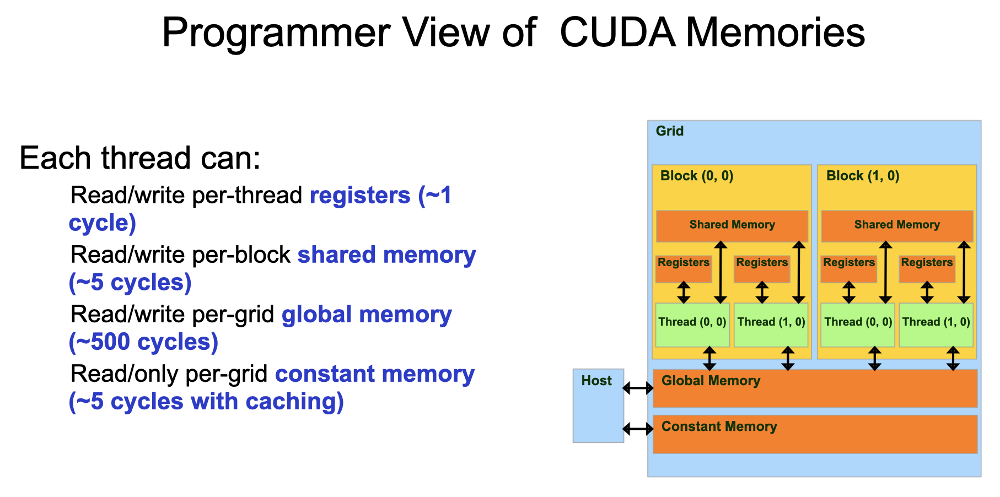
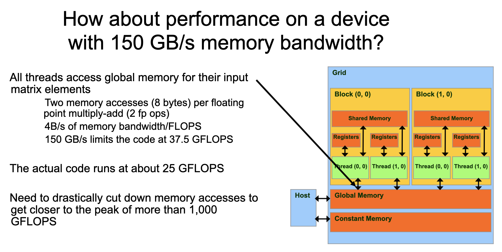
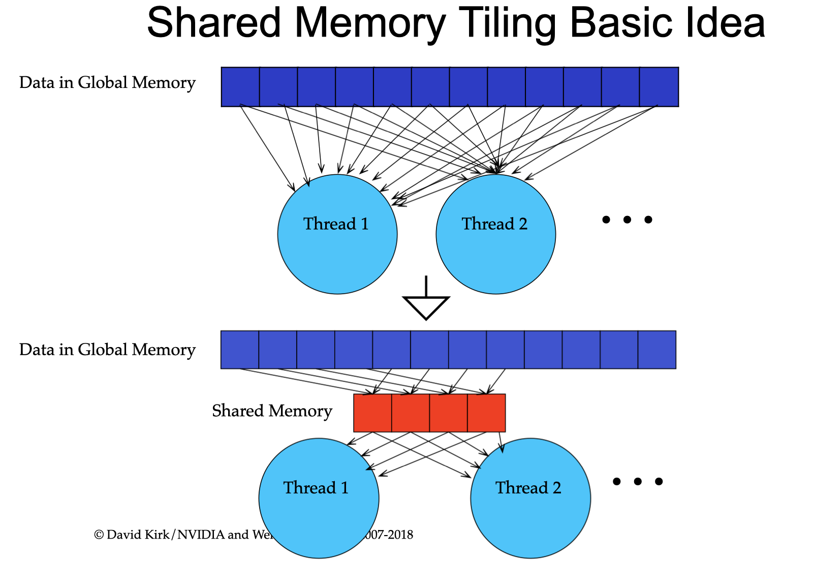
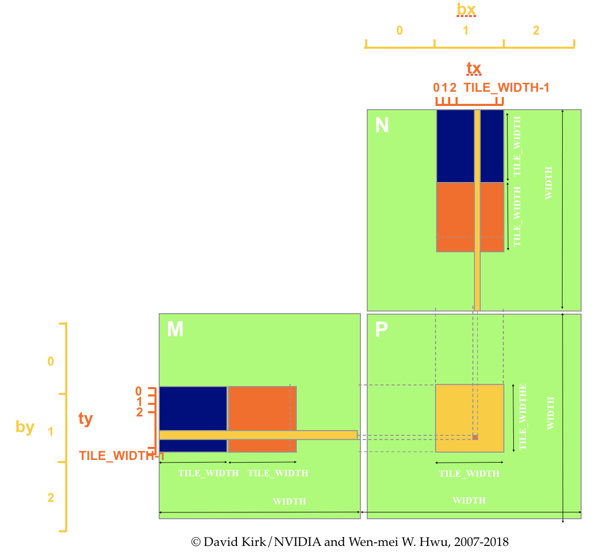

## Moore's Law

{width=60%}

## Dennard scaling

::: {.columns}
:::::: {.column width=50%}

   

- voltage drain, capacitance, inductance $∝$ transistor size
- clock frequency $∝ 1 /$ transistor size
- total power is the same!

::::::
:::::: {.column width=50%}

](https://miro.medium.com/max/3200/0*g3vKfFpancLiFP_l.){width=100%}

::::::
:::

## The end of scaling

{width=60%}

##

::: {.columns}
:::::: {.column width=50%}

### CPUs: Latency Oriented

- *latency* is lag a computer instruction and its completion

{.fragment data-fragment-index="0"}

:::{.fragment .current-visible data-fragment-index="1"}
- **CPU**s use all kind of complicated tricks to minimize latency
:::

::::::
:::::: {.column width=50%}

### GPUs: Throughput Oriented

- *throughput* is number of operations per unit time

{.fragment data-fragment-index="0"}

:::{.fragment .current-visible data-fragment-index="1"}
- **GPUs** maximize throughput at the cost of latency
:::

::::::
:::

:::{.fragment .current-visible data-fragment-index="2"}
Throughput $×$ Latency = Queue Size
:::

##

::: {.columns}
:::::: {.column width=50%}

### tasks can be sensitive to latency...

- serial tasks
    - sequential or iterative calculations

::::::
:::::: {.column width=50%}

### or throughput

- pleasingly/embarrassingly parallel tasks
    - calculations are independent of one another

::::::
:::

{.fragment .current-visible width=70%}

## GPU anatomy

::: {.columns}
:::::: {.column width=60%}

  

### three levels of organization:

- GPUs contain many small "threads" capable of performing calculations
     - each thread has a little bit of memory and a `threadIdx` (1, 2, or 3D)

- threads are grouped into "blocks"
    - each block has some shared memory and a  `blockIdx` (1, 2, or 3D)

 - blocks live on grids

::::::
:::::: {.column width=25%}
{width=100%}
{width=100%}
::::::
:::

## Example: Image Blurring

::: {.columns}
:::::: {.column width=30%}
      

::::::
:::::: {.column width=70%}
 
::::::
:::
##

##

## Shared memory matrix multiply

::: {.columns}
:::::: {.column width=50%}

 
 

{width=100%}

::::::
:::::: {.column width=50%}

{.fragment}

::::::
:::

## Thanks!
